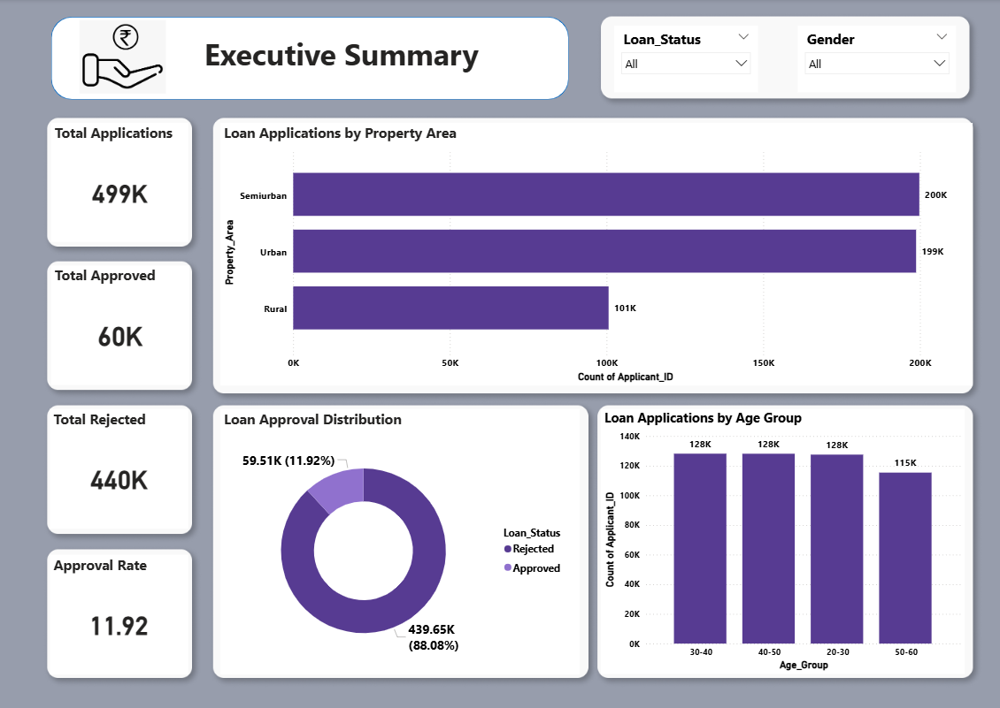
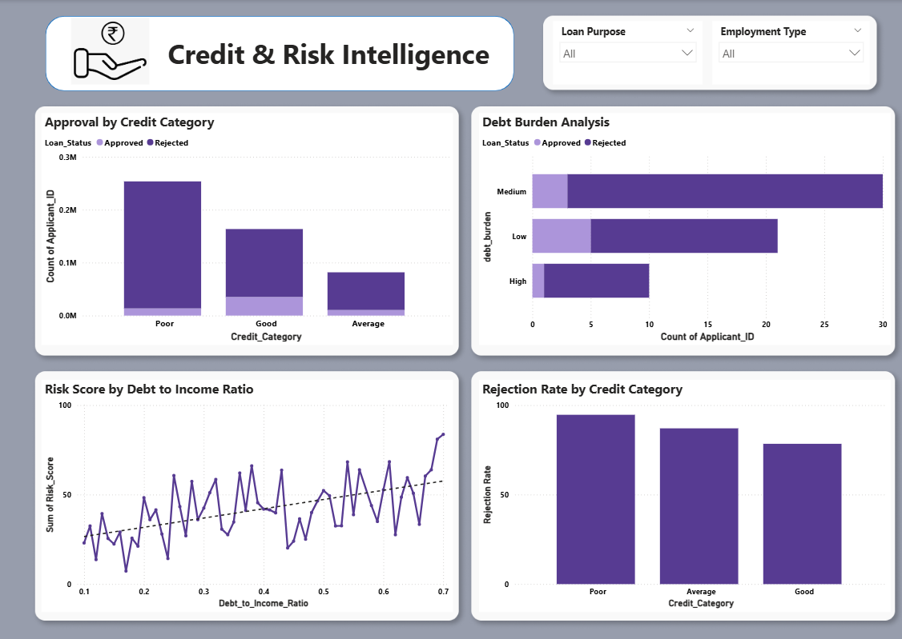

# 🏦 Loan Rejection Behavior Analyzer (End-to-End Analytics Project)

---

## 🛠 Tech Stack

**Python · MySQL · Power BI · DAX**

---

## 📌 The Problem

Modern lending systems generate massive volumes of loan application data across customer segments, financial profiles, and geographic regions. However, raw datasets alone fail to explain **why loans are approved or rejected**.

The real questions are:

* Which factors truly drive loan rejection?
* Are rejections driven more by financial instability or behavioral risk?
* Is risk concentrated in specific customer segments or evenly distributed?

👉 **Is loan rejection driven by structural financial risk or specific customer behavior patterns?**

---

## 🚀 What I Built

An **end-to-end loan analytics pipeline** that:

* Processes **500K+ loan applications**
* Cleans and engineers financial risk features using Python
* Stores and models data in a **MySQL warehouse**
* Creates analytical SQL views for business logic
* Builds **interactive Power BI dashboards** for decision-making

👉 All business logic (risk scoring, ratios, segmentation) is handled in **SQL + Python**, keeping Power BI focused purely on visualization.

---

## 🧱 Tech Stack Breakdown

| Layer                 | Tool           | Purpose                                      |
| --------------------- | -------------- | -------------------------------------------- |
| Data Processing       | Python         | Data cleaning, feature engineering           |
| Warehouse & Analytics | MySQL          | Star schema, analytical views, risk modeling |
| Visualization         | Power BI + DAX | Dashboard design, KPI tracking               |

---

## 📊 Dashboard Pages

### 1. Executive Summary

High-level overview of loan performance:

* Total Applications
* Approval vs Rejection
* Approval Rate
* Loan distribution by purpose and region 

---

### 2. Credit & Risk Intelligence

Core risk analysis layer:

* Credit Category vs Approval
* Debt-to-Income (DTI) impact
* Risk Score vs Financial Behavior
* High-Risk customer identification



📄 [Full Dashboard PDF — all four pages](Dashboard.pdf.pdf)

---

## 📈 Key Findings

* **Credit Score < 620 → High rejection probability** (primary risk driver)
* **High DTI customers → 2x higher rejection risk**
* **Salaried customers show higher approval rates** (income stability effect)
* **Large loans carry higher default risk exposure**
* **Financial strength (Income vs Loan ratio) strongly influences approval**

---

## 📊 Recommendations

* **Risk-Based Lending:** Focus approval logic on DTI and credit score thresholds
* **Customer Targeting:** Prioritize salaried and stable-income applicants
* **Loan Optimization:** Limit high-value loans for high-risk segments
* **Financial Profiling:** Use engineered features (DTI, Risk Score) for decision systems

---

## 🧠 Data Model

Warehouse-first design using MySQL:

```
Raw Data → Feature Engineering → SQL Warehouse → Analytical Views → Power BI
```

### Structure:

```
03_SQL/
├── 01_staging            Raw cleaned data
├── 02_dimensions         Customer, Demographics
├── 03_facts              Loan applications
├── 04_views
│   ├── Risk Views        Risk scoring & segmentation
│   ├── Financial Views   Income, DTI, ratios
│   ├── Customer Views    Demographic insights
│   └── Master View       KPI aggregation
```

---

## 📁 Repo Structure

```
Loan_Analytics_Project/
│
├── 01_Data/              Raw dataset (CSV)
├── 02_Notebooks/         Python cleaning & feature engineering
├── 03_SQL/               Schema, views, analytical queries
├── 04_PowerBI/           Dashboard (.pbix file)
├── 05_Documentation/     Project explanation & methodology
├── 06_Insights/          Business insights
└── 07_Dashboard/         Dashboard screenshots
```

---

## 📚 Documentation

| Document         | Description                          |
| ---------------- | ------------------------------------ |
| Project Overview | Problem, objectives, scope           |
| Data Processing  | Cleaning & feature engineering logic |
| SQL Architecture | Schema design & analytical views     |
| Dashboard Design | Page structure & KPI logic           |
| KPI Definitions  | Metrics & calculations               |
| Insights         | Business interpretation              |

---

## 💥 Project Outcome

* Built a **complete end-to-end analytics pipeline**
* Identified **hidden patterns behind loan rejection decisions**
* Delivered **interactive dashboards for decision-making**
* Simulated a **real-world banking analytics system**

---

## 🧠 Resume Line

> Built an end-to-end loan analytics system using Python, MySQL, and Power BI to analyze 500K+ loan applications, identify risk patterns, and develop interactive dashboards for business decision-making.

---

## 🔥 Final Note

This project demonstrates:

* Data Cleaning & Feature Engineering
* SQL-Based Analytics
* Data Modeling (Star Schema)
* Business Intelligence & Visualization

👉 Suitable for **Data Analyst / Business Analyst / BI roles**

---
